<h1 align="center">
  
</h1>

## 🚀 Featured Projects

<!-- ═══════════════════════════════════════════════════════════════════════════════ -->

<table>
<tr>
<td width="50%" valign="top">

### Shopiverse

 

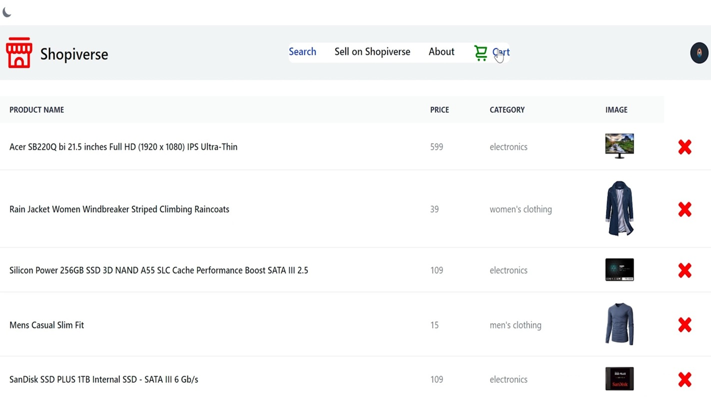

**E-commerce platform with authentication, product management, and payment processing.**

 

</td>
<td width="50%" valign="top">

### Task Board (Drag & Drop)

 

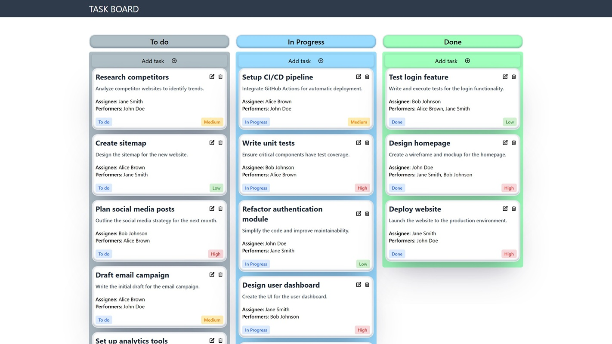

**Kanban-style task management with drag & drop functionality.**

 

</td>
</tr>
</table>

<!-- ═══════════════════════════════════════════════════════════════════════════════ -->

<table>
<tr>
<td width="50%" valign="top">

### Inventory Demo App

 

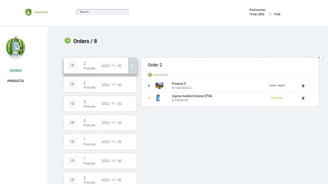

**Order and product management system with category organization.**

 

</td>
<td width="50%" valign="top">

### Nutrition Analysis

 

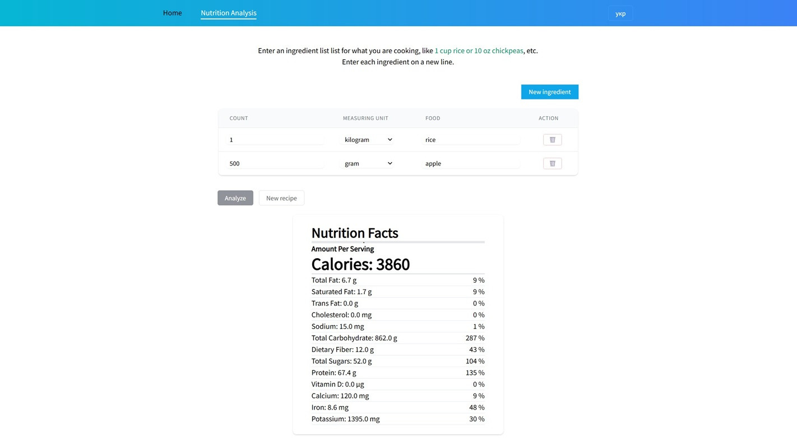

**Research calorie content and nutrient breakdown for dishes.**

 

</td>
</tr>
</table>

<!-- ═══════════════════════════════════════════════════════════════════════════════ -->

<table>
<tr>
<td width="50%" valign="top">

### Fruit Catalog

 

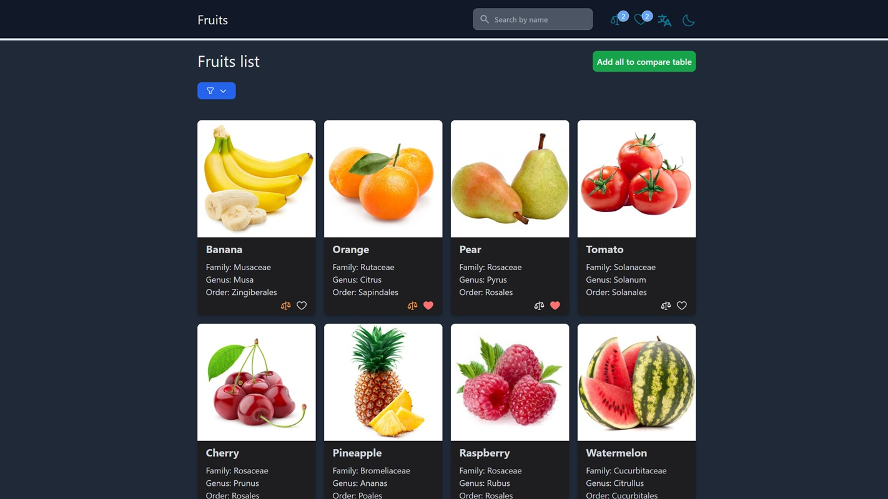

**Product catalog with favorites, comparison, themes, and i18n support.**

 

</td>
<td width="50%" valign="top">

### Posts Demo

 

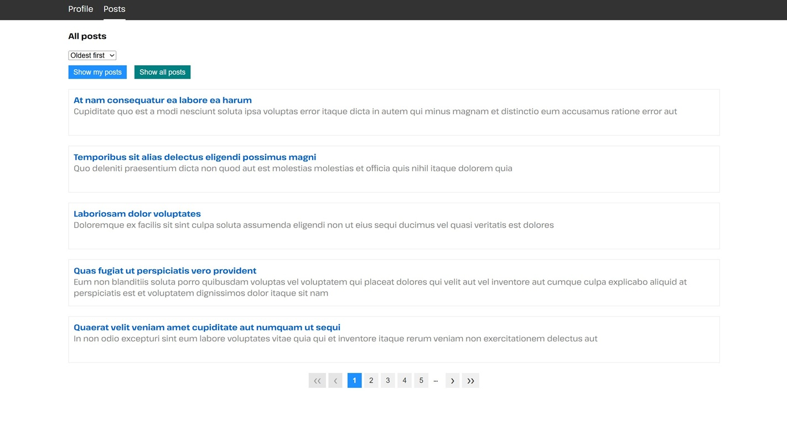

**Blog platform with CRUD operations, filtering, sorting, and comments.**

 

</td>
</tr>
</table>

<!-- ═══════════════════════════════════════════════════════════════════════════════ -->

<table>
<tr>
<td width="50%" valign="top">

### Todo App

 

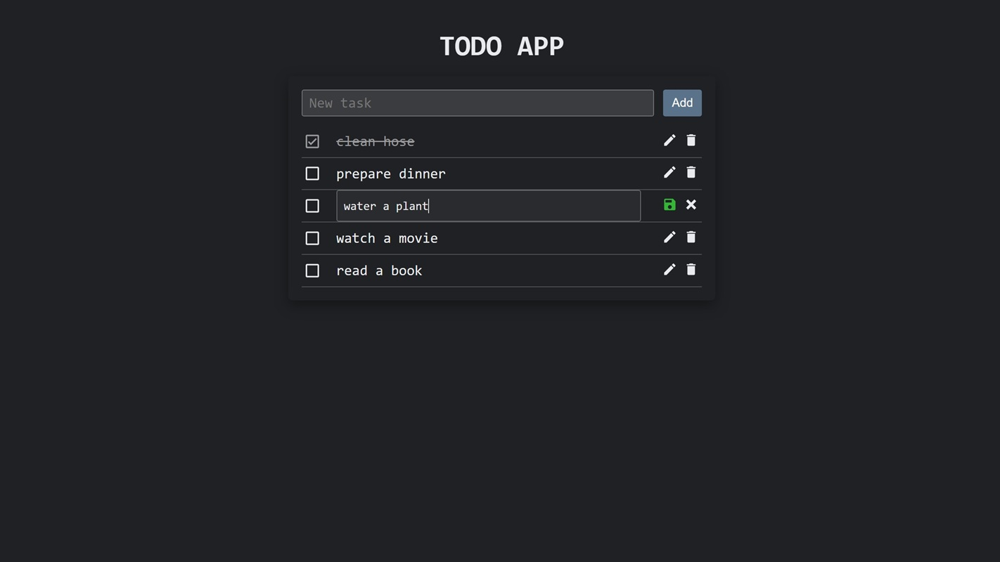

**Task management app with full CRUD functionality.**

 

</td>
<td width="50%" valign="top">

### Image Carousel

 

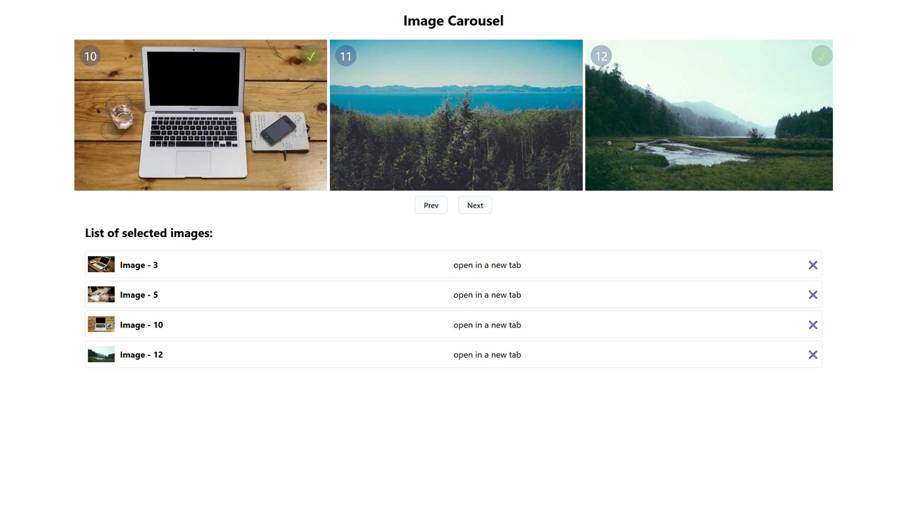

**Infinite scrolling image gallery with selection feature.**

 

</td>
</tr>
</table>

<!-- ═══════════════════════════════════════════════════════════════════════════════ -->

<table>
<tr>
<td width="50%" valign="top">

### Landing "Cleaning"

 

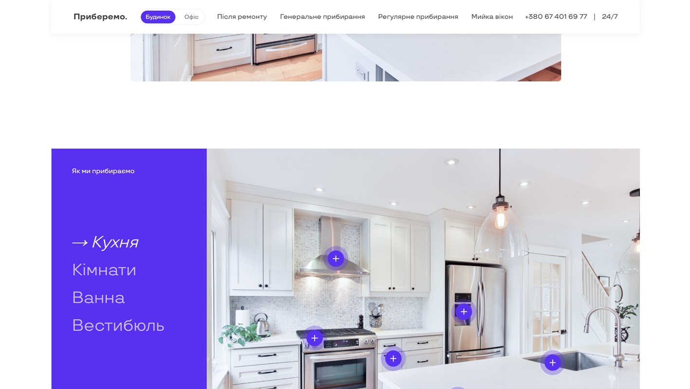

**Animated cleaning service landing with modern design.**

 

</td>
<td width="50%" valign="top">

### Guess a Number

 

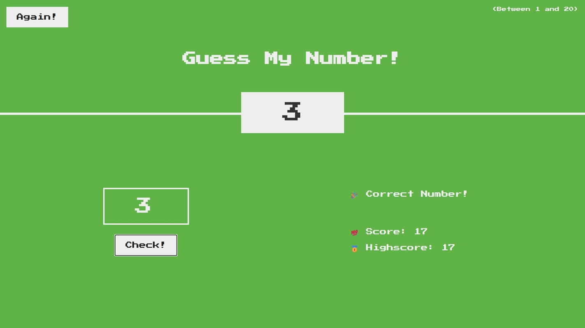

**Interactive number guessing game (1-20).**

 

</td>
</tr>
</table>

<!-- ═══════════════════════════════════════════════════════════════════════════════ -->

## 📚 Other Projects

<table>
<tr>
<td width="50%" valign="top">

### Book Catalog

 

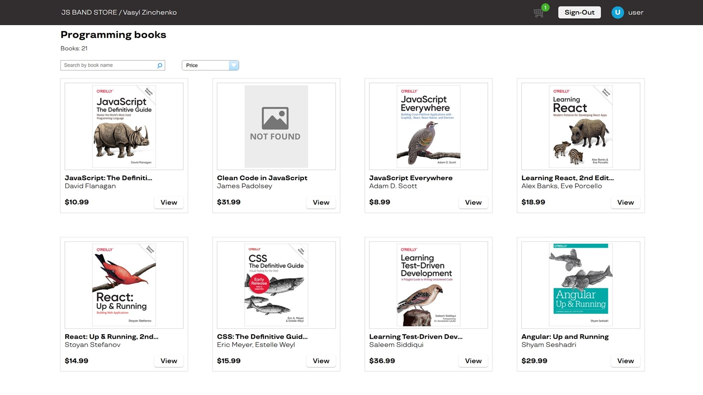

**Book store with filtering, sorting, and shopping cart.**

 

</td>
<td width="50%" valign="top">

### Find a Coach

 

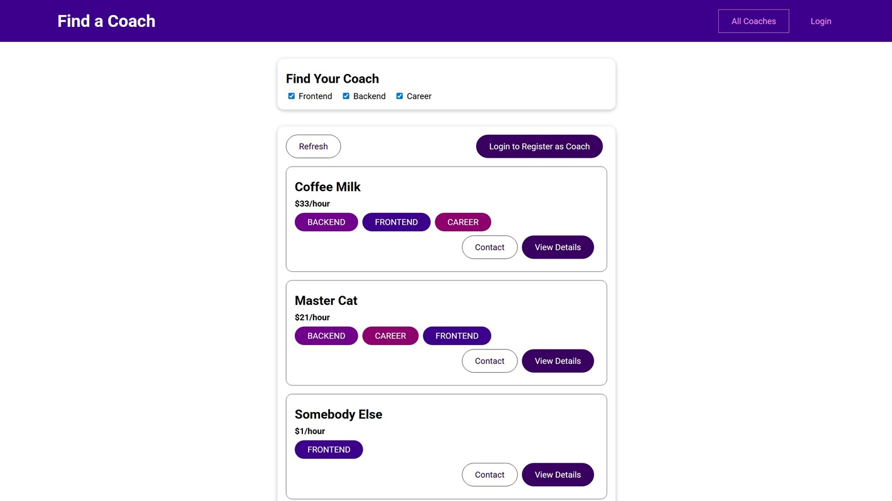

**Coach finder with auth, messaging, and request management.**

 

</td>
</tr>
</table>

<!-- ═══════════════════════════════════════════════════════════════════════════════ -->

<table>
<tr>
<td width="50%" valign="top">

### Phone Catalog

 

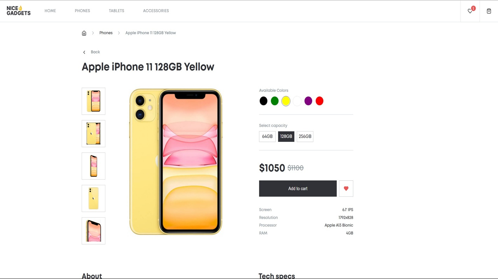

**Product catalog built with team collaboration.**

 

</td>
<td width="50%" valign="top">

### Landing "Save The Ocean"

 

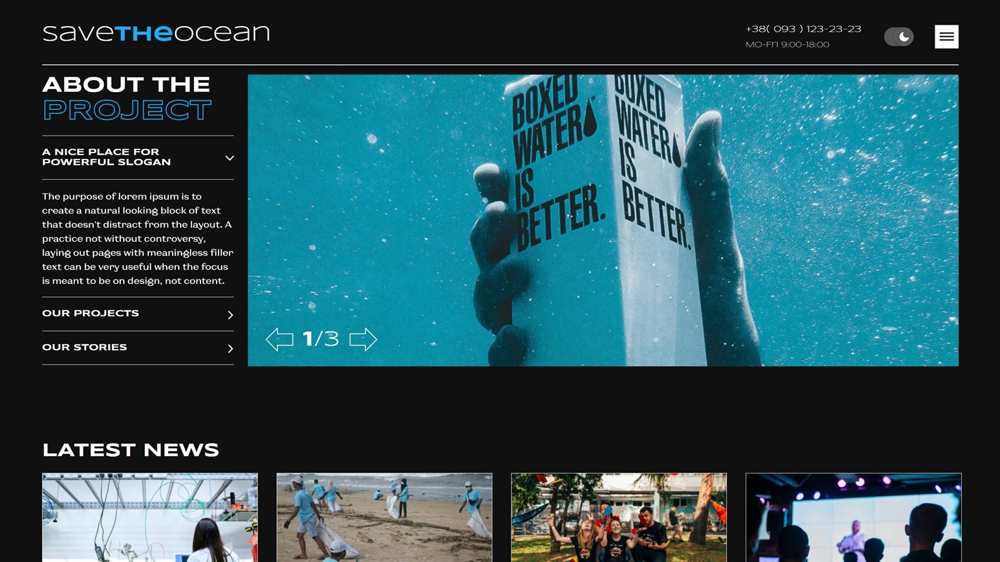

**Responsive landing page with smooth animations.**

 

</td>
</tr>
</table>

<!-- ═══════════════════════════════════════════════════════════════════════════════ -->

<table>
<tr>
<td width="50%" valign="top">

### Landing "Kickstarter"

 

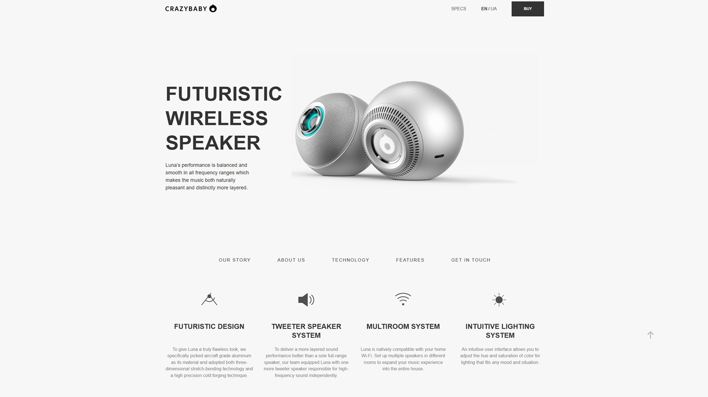

**Pixel-perfect responsive landing from Figma.**

 

</td>
<td width="50%" valign="top">

### Landing "MyBike"

 

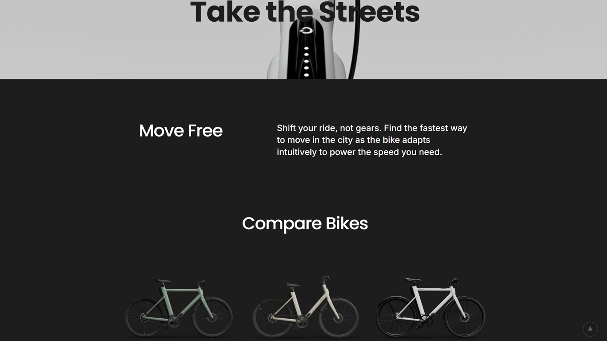

**Bike rental landing with grid layout.**

 

</td>
</tr>
</table>
